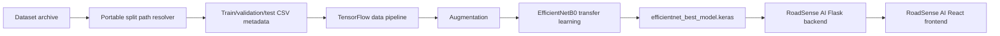

# RoadSense AI ML

Machine learning assets and training notebooks for RoadSense AI road issue classification. This repository is reconstructed primarily from the ML implementation in the original AsphaltAegis COMP258 team project. It owns the training notebooks, split metadata, portable dataset-path tooling, and the trained EfficientNetB0 model consumed at runtime by the separate Flask backend.

RoadSense AI is an intelligent road issue detection and RAG AI assistant platform. This repository covers only the image-classification ML component. It does not contain the React frontend or Flask API implementation.

## Project Overview

The classifier predicts one road or public-area issue from an uploaded image. The original implementation uses transfer learning with TensorFlow and EfficientNetB0, trained on 224 x 224 RGB images. The resulting seven-class model is loaded by `RoadSense-AI-Backend/services/model_service.py`, which returns a class label and confidence score to the frontend through the Flask API.

The implementation is a portfolio separation of an educational COMP258 team project developed at Centennial College. The original team work is not presented as entirely individual work.

## Deployment Notes

See [DEPLOYMENT.md](DEPLOYMENT.md) for the production model artifact, checksum, release process, and backend deployment handoff.

## Classification Classes

The numeric ordering is part of the model/backend contract and must not be alphabetically reordered:

| Index | Class |
| ---: | --- |
| 0 | Broken Road Sign Issues |
| 1 | Damaged Road issues |
| 2 | Illegal Parking Issues |
| 3 | Littering Garbage on Public Places Issues |
| 4 | Mixed Issues |
| 5 | Pothole Issues |
| 6 | Vandalism Issues |

This ordering is consistent across the original split CSVs and the backend `CLASS_NAMES` list. The training notebook's later `sorted(train_df["label"].unique())` expression was not retained in the portable evaluation path because alphabetical ordering would not match the saved model's numeric outputs.

## System Architecture



The broader platform also includes a separate backend RAG pipeline using Sentence Transformers, FAISS, and Ollama. Those components are not part of this ML training repository.

## Dataset

The downloaded `RoadSense-AI-archive` contains 9,659 JPG files under a hierarchy rooted at `data/`. The original split CSVs contain 6,759 training rows, 1,449 validation rows, and 1,449 test rows, for 9,657 total split rows. The archive therefore appears to be the source dataset used by the original project, with two archive images not represented in the saved split metadata.

The archive contains these class directories:

```text
data/
├── Public Cleanliness + Environmental Issues/
│   ├── Littering Garbage on Public Places Issues/
│   └── Vandalism Issues/
└── Road Issues/
		├── Broken Road Sign Issues/
		├── Damaged Road issues/
		├── Illegal Parking Issues/
		├── Mixed Issues/
		└── Pothole Issues/
```

The original CSV paths refer to another developer's machine, for example:

```text
C:\Users\ASUS\Documents\8\comp258_f25\Final_Project\road_issues_detection\data\Road Issues\Pothole Issues\...
```

Those paths are not portable and are not used directly by the separated notebooks.

### Dataset setup

Do not copy the complete dataset into Git by default. The archive is large and its licensing/provenance should be handled separately. Place or extract the dataset locally so that its `data` directory is the dataset root supplied to the resolver:

```text
local-dataset/
├── Public Cleanliness + Environmental Issues/
└── Road Issues/
```

Set `DATASET_ROOT` to that directory. For the provided archive on Windows:

```powershell
$env:DATASET_ROOT = "D:\mac\Centennial-College\Web-Portfolio\RoadSense-AI-archive\data"
python scripts/resolve_split_paths.py --dataset-root $env:DATASET_ROOT
```

The resolver reads the original `data/train_split.csv`, `data/val_split.csv`, and `data/test_split.csv`, replaces only their machine-specific path prefix, verifies every referenced image exists, and writes local copies to `data/portable/`. It preserves the original rows, labels, indices, and train/validation/test membership; it does not randomly create new splits.

## Original ML Implementation

The original project provides three notebooks:

- `phase2_preprocessing.ipynb`: scans the dataset hierarchy, derives labels from the final directory name, and creates stratified train/validation/test metadata with `random_state=42`.
- `phase3_data_pipeline.ipynb`: loads the split metadata and builds TensorFlow datasets.
- `phase4_train_efficientnet.ipynb`: trains, fine-tunes, evaluates, saves, and reloads the EfficientNetB0 classifier.

The original `train.py` and `evaluate.py` files are empty, so they are intentionally excluded. The notebooks are the actual source of the training and evaluation implementation and were copied as the primary ML source. They were updated only where required to resolve local dataset paths and preserve the model class ordering.

## Preprocessing and Data Pipeline

The verified pipeline performs these steps:

1. Read split metadata from CSV.
2. Resolve each original `filepath` against a local `DATASET_ROOT`.
3. Read JPEG files with TensorFlow.
4. Decode them as three-channel RGB images.
5. Resize them to 224 x 224.
6. Cast pixels to `float32`.
7. Apply horizontal random flips and random rotations of approximately 5% to training images.
8. Batch with size 32 and prefetch using TensorFlow AUTOTUNE.

The source training notebook intentionally does not divide image pixels by 255. The backend applies TensorFlow EfficientNet preprocessing before inference, so training and inference should continue to be treated as a coupled contract and verified together when retraining.

## EfficientNetB0 Training

The training notebook builds:

```text
EfficientNetB0(include_top=False, weights="imagenet", input_shape=(224, 224, 3))
	-> GlobalAveragePooling2D
	-> Dropout(0.3)
	-> Dense(7, activation="softmax")
```

Training occurs in two phases:

- Warm-up: EfficientNetB0 base frozen, Adam learning rate `1e-3`, up to 10 epochs.
- Fine-tuning: base model enabled with the first 200 layers frozen, Adam learning rate `1e-4`, up to 30 epochs.

The notebook uses balanced class weights, early stopping on validation loss with patience 5, and `ReduceLROnPlateau` with patience 2 and factor 0.5. The model is saved as `efficientnet_best_model.keras`.

## Evaluation

The notebook evaluates the test dataset and reports:

- Test loss
- Test accuracy
- Confusion matrix
- Scikit-learn classification report with precision, recall, and F1-score
- Sample predictions
- Misclassified image examples

The checked-in model card describes approximate test accuracy in the 90–95% range, but the repository does not contain a fresh reproducible evaluation output. Treat that figure as historical documentation rather than a newly verified benchmark.

## Model Artifact

The trained model at `models/efficientnet_best_model.keras` is 33,574,604 bytes and originated from the original project's `ml/saved_model/efficientnet_best_model.keras`. Its actual loaded signature was inspected through the backend virtual environment: the model uses a 224 x 224 x 3 input and produces seven output values.

This ML repository is the logical owner of the trained model. At approximately 33.6 MB it is below GitHub's 100 MB hard file limit, but Git LFS or a release artifact is preferable for a long-lived portfolio repository because model binaries change independently of source code. If the model is kept in ordinary Git, ensure the repository's hosting limits and licensing allow it.

The backend should consume this artifact rather than maintain a second independent copy. Its `MODEL_PATH` setting can point to a local copy of this model:

```text
MODEL_PATH=..\RoadSense-AI-ML\models\efficientnet_best_model.keras
```

The exact path depends on the local checkout layout. The backend does not automatically download the model.

## Repository Structure

```text
RoadSense-AI-ML/
├── data/
│   ├── test_split.csv
│   ├── train_split.csv
│   └── val_split.csv
├── models/
│   └── efficientnet_best_model.keras
├── notebooks/
│   ├── phase2_preprocessing.ipynb
│   ├── phase3_data_pipeline.ipynb
│   └── phase4_train_efficientnet.ipynb
├── scripts/
│   └── resolve_split_paths.py
├── .gitignore
├── README.md
└── requirements.txt
```

`data/portable/` is generated locally and ignored by Git. A local dataset directory is also ignored when named `dataset/`.

## Setup and Reproduction

The notebooks were authored for Python 3.10 or newer in the original project. Create an environment and install the ML dependencies:

```powershell
python -m venv .venv
.\.venv\Scripts\Activate.ps1
python -m pip install --upgrade pip
python -m pip install -r requirements.txt
```

Set the dataset root and generate portable split paths:

```powershell
$env:DATASET_ROOT = "D:\path\to\RoadSense-AI-archive\data"
python scripts/resolve_split_paths.py --dataset-root $env:DATASET_ROOT
```

Open the notebooks from this repository and run them in order. The phase 4 notebook expects `DATASET_ROOT` to be set and reads the generated `data/portable/` files. Full retraining requires the complete local dataset, compatible TensorFlow, ImageNet weight access on first model creation, and substantial compute. The checked-in `.keras` model can be used for inference without retraining.

## Backend and Frontend Integration

The runtime relationship is:

```text
Dataset -> Preprocessing -> Training -> EfficientNetB0 Model
																			-> Flask Backend
																			-> React Frontend
```

The backend endpoint is `POST /api/predict`. It accepts an image in the multipart `image` field and returns `class_name` plus `confidence`. The frontend sends requests to `http://127.0.0.1:5000/api/predict` and displays the returned `class_name` without changing its value.

The separated frontend and backend currently use local port 5000. Chat and RAG use the same Flask server but are independent of this image-classification repository.

## Known Cross-Repository Issues

- The original CSV paths were machine-specific; the resolver and copied notebooks address this without changing split membership.
- The backend loads the model during import, so `/api/health` also requires a valid `MODEL_PATH` and model file.
- The backend has an ignored local `models/` location, but the model should be owned here and referenced or copied deliberately rather than silently duplicated.
- The frontend hardcodes `127.0.0.1:5000` for prediction. A deployed setup requires frontend API configuration changes.
- The original phase 4 notebook contained hardcoded model-save/load paths; the portable copy should be updated to use `models/efficientnet_best_model.keras` before retraining on another machine.
- The source training scripts are empty. Reproducibility currently depends on notebook execution order and the external dataset.

## Attribution

RoadSense AI is a reorganized portfolio version of the AsphaltAegis COMP258 educational team project originally developed at Centennial College. The original documentation credits Numaan Baig, Anmol, Raj Patel, Juan, Jaturaput, Daniela, and Abdallah. This repository separates the ML component for portfolio presentation and maintainability and does not claim individual ownership of the complete original team project.
